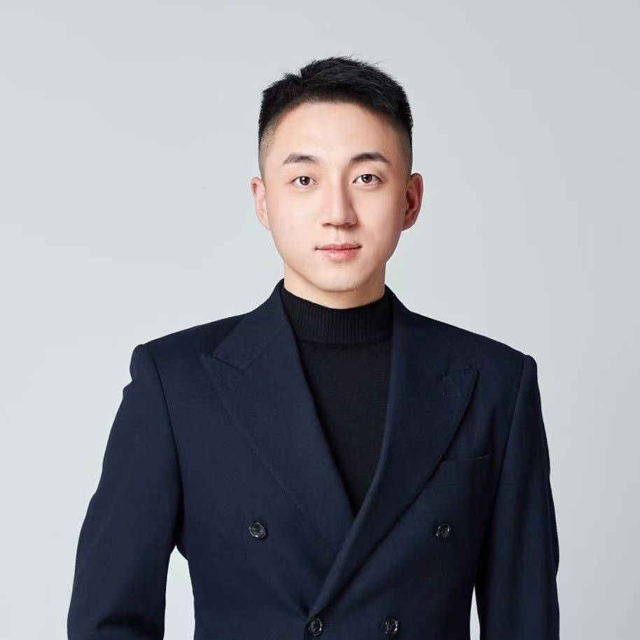

## Yuwen Dong

### Bio

Yuwen Dong is a part-time Master student of Engineering Management (MEM) in Tsinghua University advised of Prof. Gao Huang. Also, he is a Senior Product Manager at NetEase currently. He earned his Bachelor of Engineering degree from the NanJing University of Aeronautics and Astronautics in 2015. His research primarily focuses on LLM-based Agents and Multimodal Learning.

### Tags
 LLM-based Agents, LLM Reasoning

